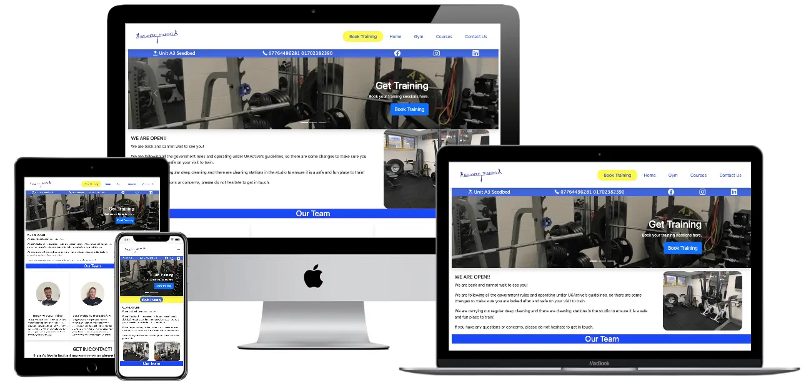
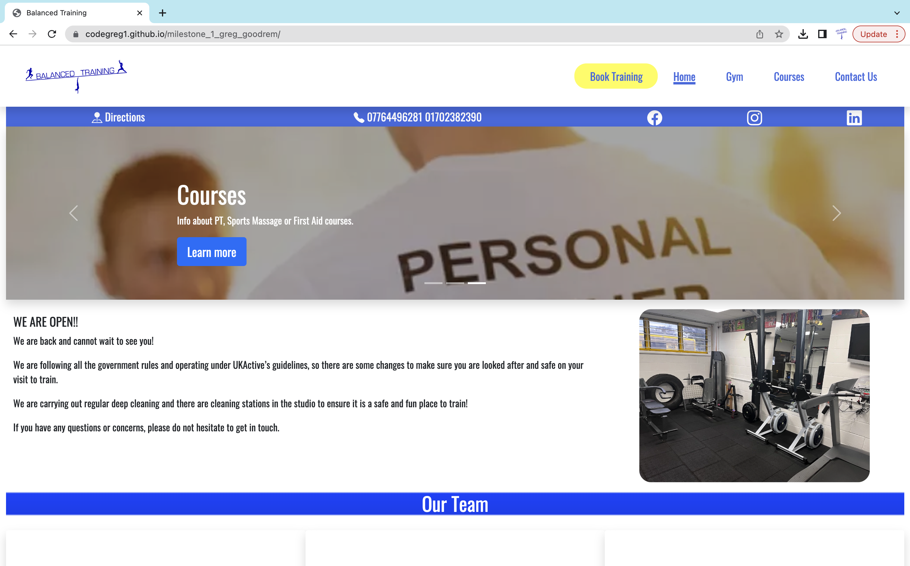
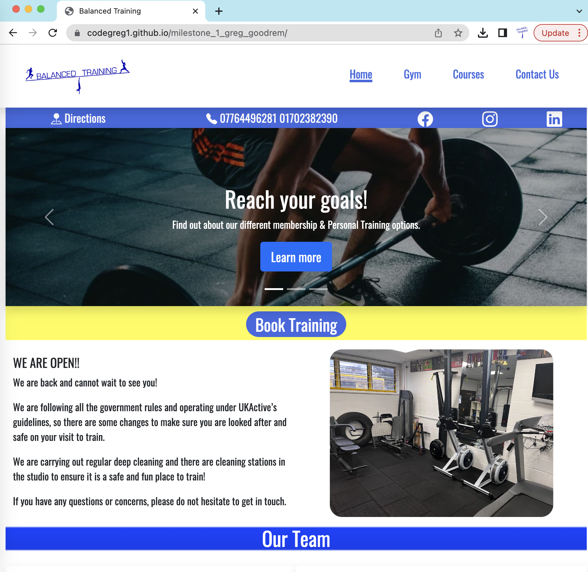
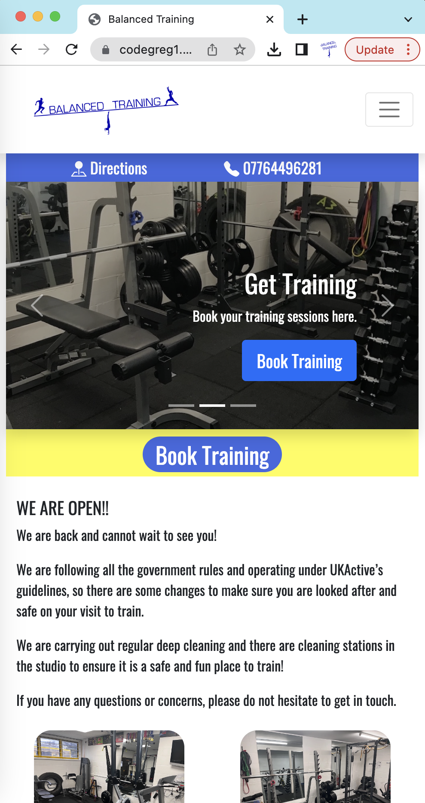
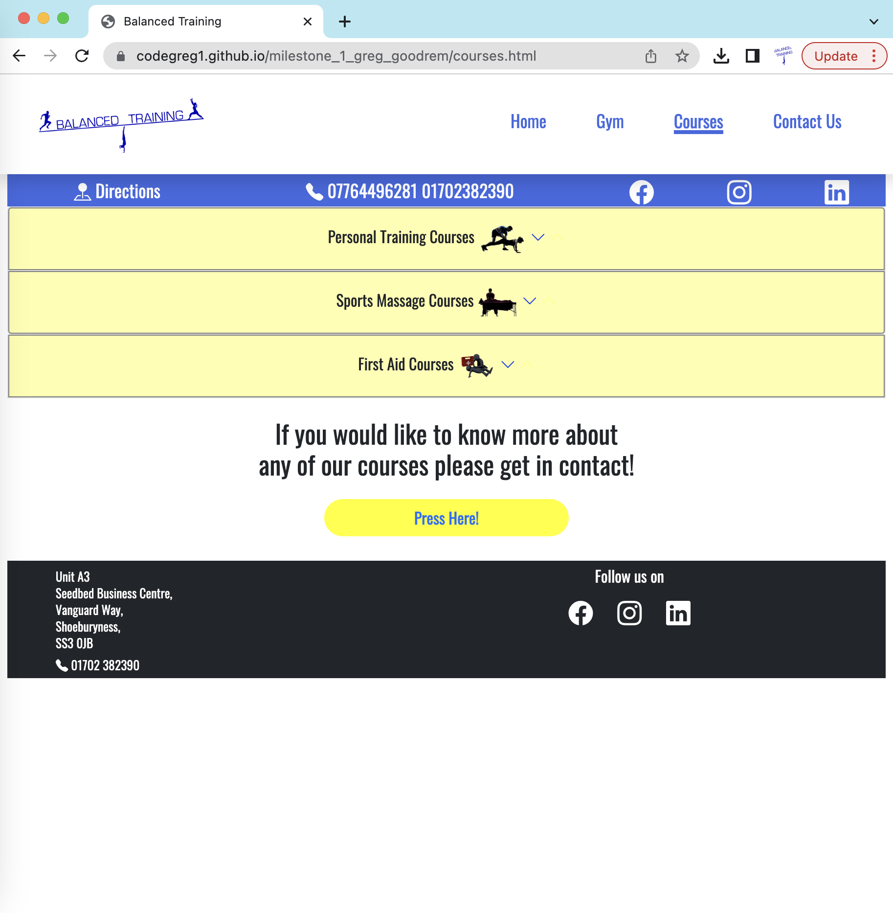
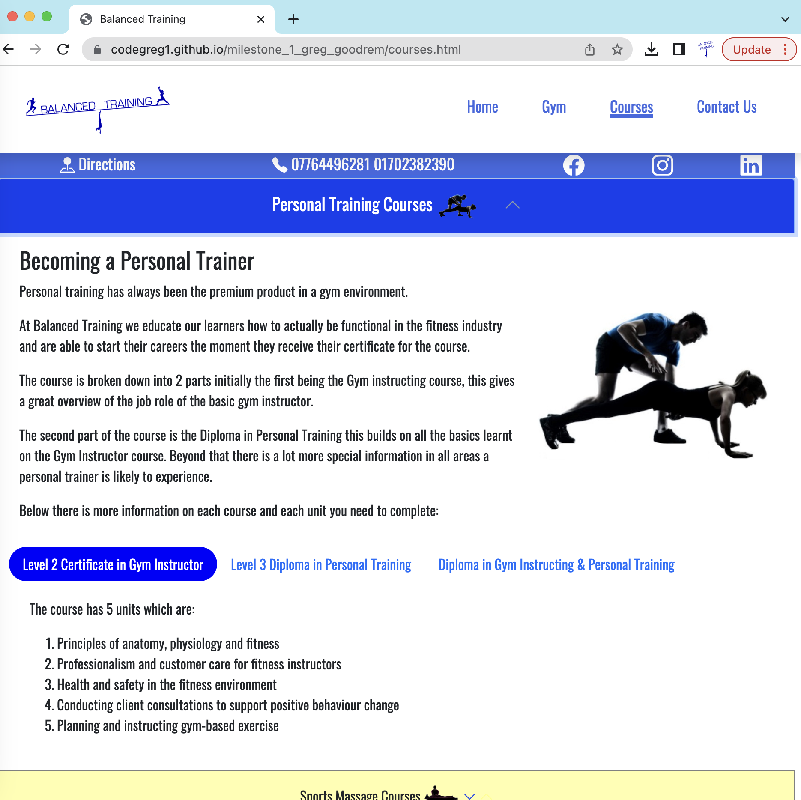
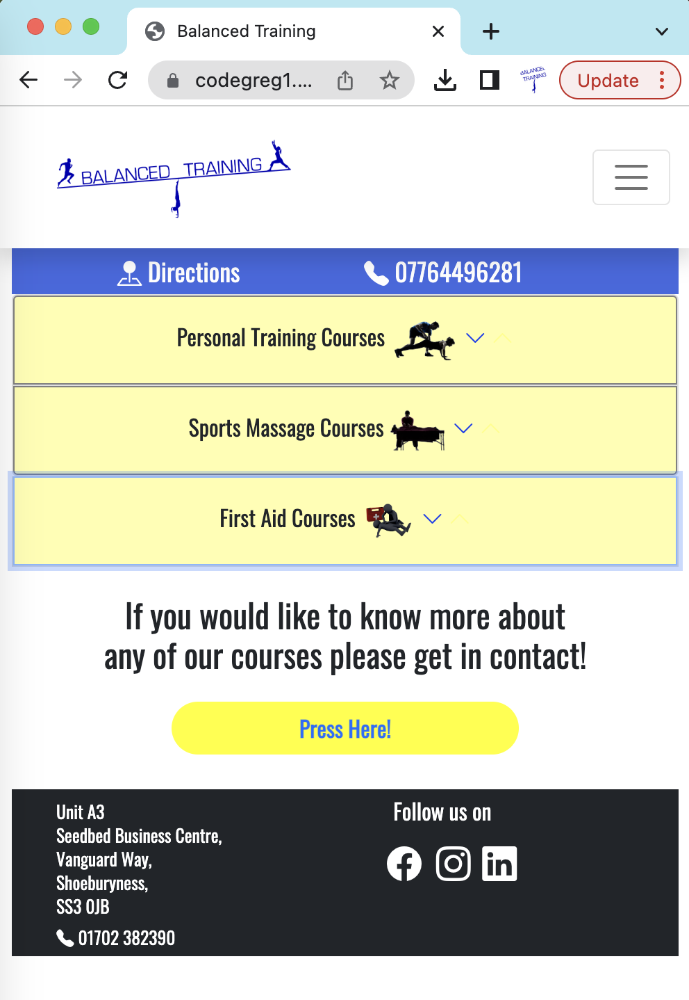
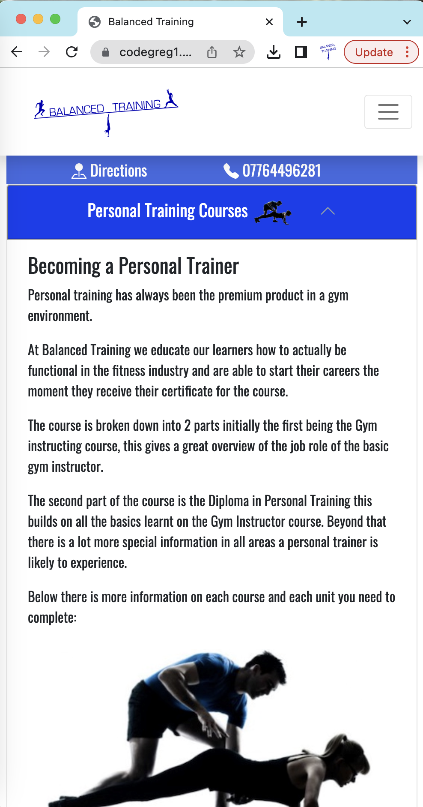

<h1 align="center">Greg Goodrem Milestone Project 1</h1>

[View the live project here.](https://codegreg1.github.io/milestone_1_greg_goodrem/)
This is the main website for Balanced Training, it is designed to be responsive to multiple devices and made easy to navigate for the multiple roles people would visit the website for, these include information on personal training, sports massage, memberships and courses.

<h2 align="center"></h2>

## User Experience (UX)

-   ### User stories

    -   #### First Time Visitor Goals

        1. As a First Time Visitor, I want to be able to navigate to the different sections of the website to gain a basic knowledge of what Balanced Training offers. 
        easily understand the main purpose of the site and learn more about the different things that happen at Balanced Training.
        2. As a First Time Visitor, I want them to make contact to find out more information or book their own session.
        3. As a First Time Visitor, I want them to be able to find us easily in their local area and come in during opening hours.

    -   #### Returning Visitor Goals

        1. As a Returning Visitor, I want them to use the booking function on the website to book their own sessions.
        2. As a Returning Visitor, I want them to learn more about the different courses.
        3. As a Returning Visitor, I want them to find the links to our social media sites.

    -   #### Frequent User Goals
        1. As a Frequent User, I want them to book every session through the website. 
        2. As a Frequent User, I want them to make contact with us through the website about any issues or ways we can help them.
        3. As a Frequent User, I want them to connect with our social media frequently to see the gym challenges and new course dates.

-   ### Design
    -   #### Colour Scheme
        -   The two main colours used are Blue and Yellow.
    -   #### Typography
        -   The Roboto font is the main font used throughout the whole website with Sans Serif as the fallback font in case for any reason the font isn't being imported into the site correctly. Roboto is a clean and clear font which makes it really easy to read exactly what is written on site.
    -   #### Imagery
        -   Imagery is important, the pictures are in the most part real and not so much commercial stock images. We have taken photos so that users can connect with Balanced Training as a more personal and community focused place.
    -   #### Responsive Pages 
        -   Please see below examples of the responsiveness of the website changing the layout order based on the screen sizes.
        -   Main Page on Desktop
        
        -   Main Page on tablet size screen
        
        -   Main Page on phone size screen
        
        -   Also to add to this you can see the use of multiple dropdowns on other pages. The purpose of these were to enable the different types of visitors to go directly to their desired information as the website offers lots of information about different services.
        -   Tablet view of courses page
        
        -   Tablet view of courses page once the personal training courses were selected.
        
        -   Phone view of courses page
        
        -   Tablet view of courses page once the personal training courses were selected.
        
-   ### Wireframes
    -   Home Page Wireframe - [View](https://codegreg1.github.io/milestone_1_greg_goodrem/assets/images/home-wireframe.png)

    -   Gym Page Wireframe - [View](https://codegreg1.github.io/milestone_1_greg_goodrem/assets/images/gym-wireframe.png)

    -   Courses Page Wireframe - [View](https://codegreg1.github.io/milestone_1_greg_goodrem/assets/images/courses-wireframe.png)

    -   Contact Us Page Wireframe - [View](https://codegreg1.github.io/milestone_1_greg_goodrem/assets/images/contact-us-wireframe.png)

## Features

-   Responsive on all device sizes

-   Interactive elements such as the slider which goes through the main 3 areas of the website (Gym/Courses/Booking).

-   The booking systemcurrently used is calendly which in the future I would look to use API and integrate into the website.

-   There is a sub-header which has both contacts to social media and a link to google maps for directions from the users current location.

-   There are elements set to be viewable only at certain size screens.

-   On the gym and courses pages I have used accordions to try and contain all basic information to one page for that particular part of the Balanced Training business.

## Technologies Used

### Languages Used

-   [HTML5](https://en.wikipedia.org/wiki/HTML5)
-   [CSS3](https://en.wikipedia.org/wiki/Cascading_Style_Sheets)

### Frameworks, Libraries & Programs Used

1. [Bootstrap 5.1:](https://getbootstrap.com/docs/5.1/getting-started/introduction/)
    - Bootstrap was used to assist with the responsiveness and styling of the website.
1. [Google Fonts:](https://fonts.google.com/)
    - Google fonts were used to import the 'Roboto' font into the style.css file which is used on all pages throughout the project.
1. [Font Awesome:](https://fontawesome.com/)
    - Font Awesome was used on all pages throughout the website to add icons for aesthetic and UX purposes.
1. [Git:](https://git-scm.com/)
    - Git was used for version control by utilizing the Gitpod terminal to commit to Git and Push to GitHub.
1. [GitHub:](https://github.com/)
    - GitHub is used to store the projects code after being pushed from Git.
1. [Balsamiq:](https://balsamiq.com/)
    - Balsamiq was used to create the [wireframes](https://github.com/) during the design process.
1.  [EmailJS:](https://www.emailjs.com/) 
    - EmailJS was used at the end of the project to bring the contact form alive.

## Testing

The W3C Markup Validator and W3C CSS Validator Services were used to validate every page of the project to ensure there were no syntax errors in the project.

-   [W3C Markup Validator](https://validator.w3.org/nu/?doc=https%3A%2F%2Fcodegreg1.github.io%2Fmilestone_1_greg_goodrem%2Findex.html) - Results - No Errors or Warnings
-   [W3C CSS Validator](https://jigsaw.w3.org/css-validator/validator?uri=https%3A%2F%2Fcodegreg1.github.io%2Fmilestone_1_greg_goodrem%2Fassets%2Fcss%2Fstyle.css&profile=css3svg&usermedium=all&warning=1&vextwarning=&lang=en) - Results No Errors

### Testing User Stories from User Experience (UX) Section

-   #### First Time Visitor Goals

    1. As a First Time Visitor, I want to easily understand the main purpose of the site and learn more about the organisation.

        1. Upon entering the site, users are automatically greeted with a clean and easily readable navigation bar to go to the page of their choice. Underneath there is a Hero Image with Text and a "Learn More" Call to action button.
        2. The main points are made immediately with the hero image
        3. The user has two options, click the call to action buttons or scroll down, both of which will lead to the same place, to learn more about the organisation.

    2. As a First Time Visitor, I want to be able to easily be able to navigate throughout the site to find content.

        1. The site has been designed to be fluid and never to entrap the user. At the top of each page there is a clean navigation bar, each link describes what the page they will end up at clearly.
        2. At the bottom of the first 3 pages there is a redirection call to action to ensure the user always has somewhere to go and doesn't feel trapped as they get to the bottom of the page.
        3. On the Contact Us Page, after a form response is submitted, the page refreshes and the user is brought to the top of the page where the navigation bar is.

    3. As a First Time Visitor, I want to look for testimonials to understand what their users think of them and see if they are trusted. I also want to locate their social media links to see their following on social media to determine how trusted and known they are.
        1. Once the new visitor has read the About Us and What We Do text, they will notice the Why We are Loved So Much section.
        2. The user can also scroll to the bottom of any page on the site to locate social media links in the footer.
        3. At the bottom of the Contact Us page, the user is told underneath the form, that alternatively they can contact the organisation on social media which highlights the links to them.

-   #### Returning Visitor Goals

    1. As a Returning Visitor, I want to find the new programming challenges or hackathons.

        1. These are clearly shown in the banner message.
        2. They will be directed to a page with another hero image and call to action.

    2. As a Returning Visitor, I want to find the best way to get in contact with the organisation with any questions I may have.

        1. The navigation bar clearly highlights the "Contact Us" Page.
        2. Here they can fill out the form on the page or are told that alternatively they can message the organisation on social media.
        3. The footer contains links to the organisations Facebook, Twitter and Instagram page as well as the organization's email.
        4. Whichever link they click, it will be open up in a new tab to ensure the user can easily get back to the website.
        5. The email button is set up to automatically open up your email app and autofill there email address in the "To" section.

    3. As a Returning Visitor, I want to find the Facebook and social media links.
### Further Testing

-   The Website was tested on Google Chrome, Internet Explorer, Microsoft Edge and Safari browsers.
-   The website was viewed on a variety of devices such as Laptop, iPad Pro, iPhone 13 and also simulated on the inspect element.
-   A large amount of testing was done to ensure that all pages were linking correctly.
-   Friends and family members were asked to review the site and documentation to point out any bugs and/or user experience issues.

### Known Bugs

-   On some mobile devices the Slider Image pushes the size of screen out more than any of the other content on the page but doesn't effect the overall usage of this element.

-   I found several issues that were quite challenging to fix such as the accordion and tabs to function smoothly using ARIA controls however I think I worked it all out.

-   I also found some of the images had difficulty loading depending on how I added them to the HTML either directly or using CSS but again figured out what I required to have the site look how I want it to.

## Mandatory Requirements and Commentary

#### <strong>Requirement</strong>
1)  Static front end project: Write custom HTML5 and CSS3 code to create a website of at least 3 pages, or (if using a single scrolling page), at least 3 separate page areas.

#### <strong>Commentary</strong>

1)  I feel I was able to create a Static Front End Website with 4 key pages such as: Home Page, Gym Page, Courses Page, Contact Page. Each of these pages serves a purpose and is also being used by Balanced Training as their actual live website.

#### <strong>Requirement</strong>
2)   Information Architecture: Incorporate a main navigation menu and structured layout.

#### <strong>Commentary</strong>

2)  Bootstrap was used during this project to give the site a good amount of responsiveness. Emailjs was also incorporated so that people can get in contact and is able to be used in the real world. This is being used frequently by potential customers to get in contact with Balanced Training.

#### <strong>Requirement</strong>

3)  <strong>Documentation</strong>: Write a README.md file for your project that explains what the project does and the value that it provides to its users. 
-   <strong>Version Control</strong>: Use Git & GitHub for version control.
-   <strong>Attribution</strong>: Maintain clear separation between code written by you and code from external sources (e.g. libraries or tutorials). Attribute any code from external sources to its source via comments above the code and (for larger dependencies) in the README.
-   <strong>Deployment</strong>: Deploy the final version of your code to a hosting platform such as GitHub Pages.

#### <strong>Commentary</strong>
3)  <strong>Documentation</strong>: The value to the end user being both the business owner of Balanced Training and their clients has been well great. The Business owner has a way of being found by clients through Google and social media and increase it's income. To the clients they are definitely getting value through being able to book their training sessions/learn what courses are available/learn about the different gym services. The contact form is definitely working unlike previous websites so the financial value is truly a tick in the box. 
-   <strong>Version Control</strong>: Github was used for version control throughout the project.
-   <strong>Attribution</strong>: In the Technologies used there were several frameworks and libraries used. I was quite happy to get on and work through this by myself and didn't have any assistance in writing any the code so it is all my own work apart from the Technologies used such as Bootstrap and Email JS etc.
-   <strong>Deployment</strong>: The final version of the project is deployed here on github and a previous version with less optimization of picture is actually live at [Balanced Training](https://www.Balanced.Training).

## Deployment

## Credits

### Code

-   [Bootstrap4](https://getbootstrap.com/docs/4.4/getting-started/introduction/): Bootstrap Library used throughout the project mainly to make site responsive using the Bootstrap Grid System.
-   [EmailJS](https://emailjs.com/): 
    EmailJS was used at the end of the project to create a fully functioning contact us page.

### Content

-   All content was written by the developer.

### Media

-   All Images were created by the developer or previously owned and used by Balanced Training.

### Acknowledgements

-   My Mentor for continuous helpful feedback.

-   Tutor support at Code Institute for their support.